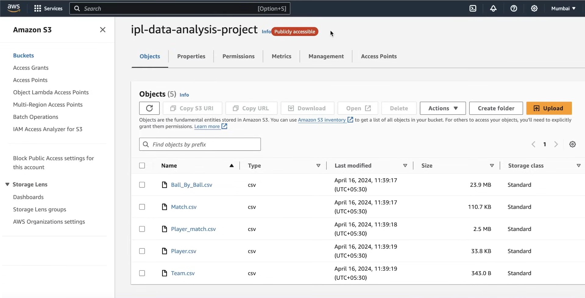
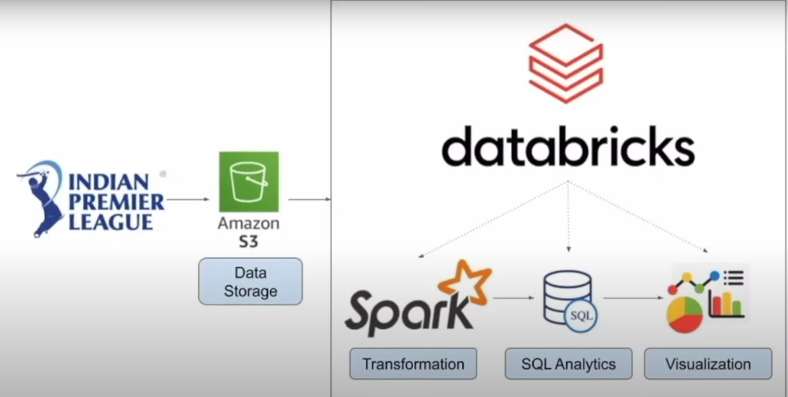
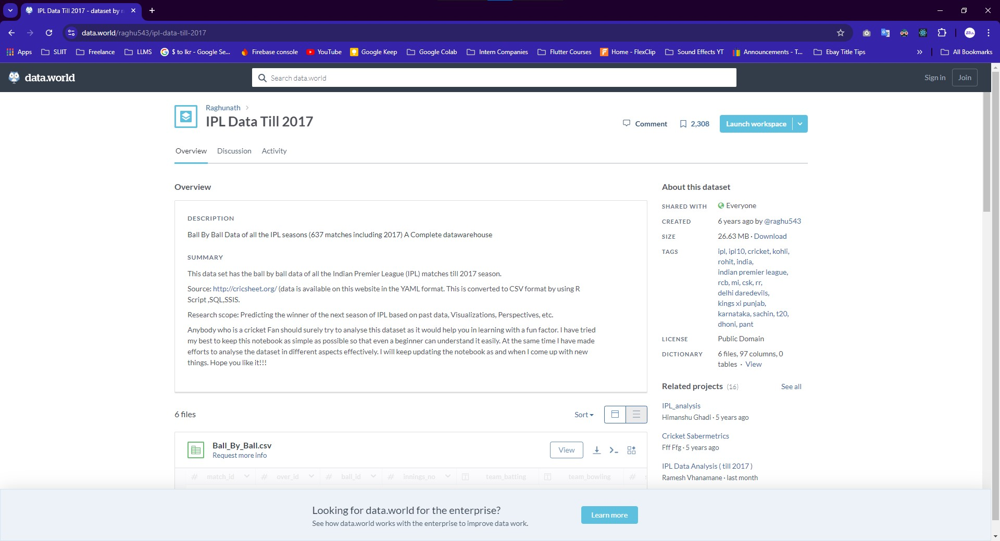
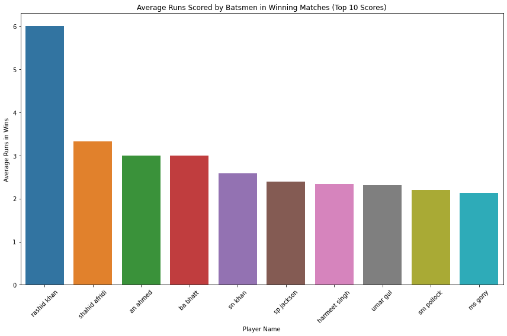
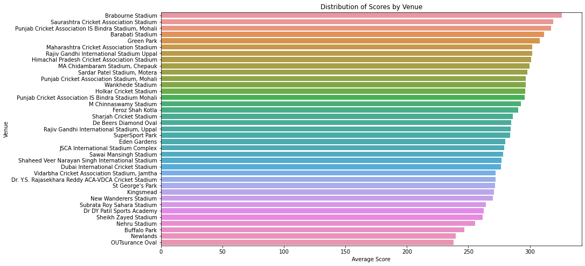
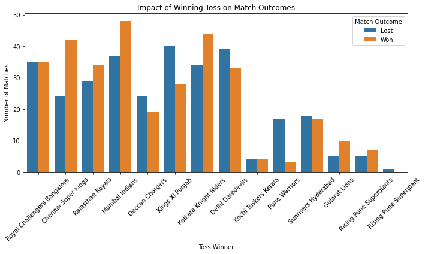
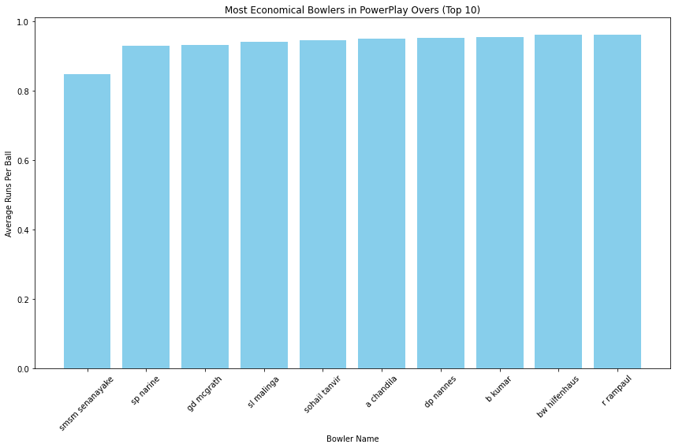
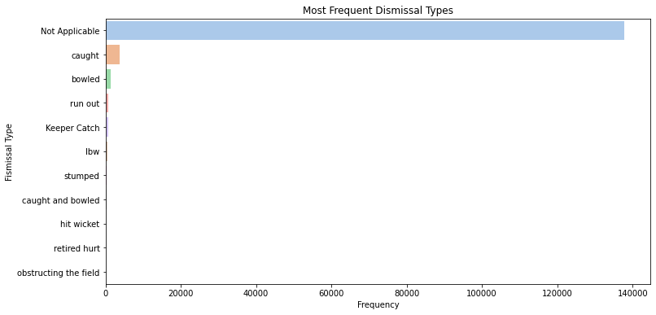
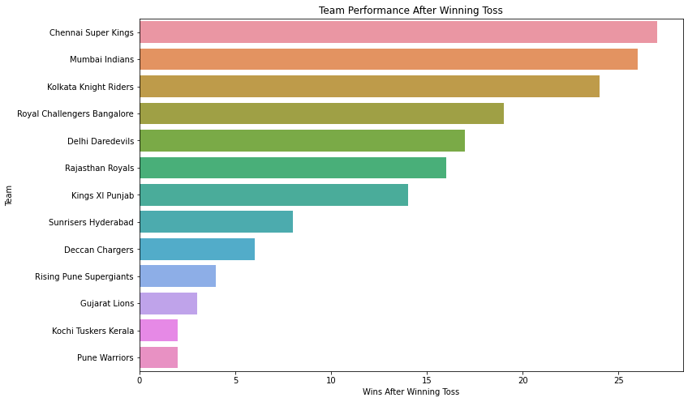

# IPL Data Engineering and Analytics with Apache Spark and Databricks 🏏📊🚀

This project showcases the development and execution of a data engineering and analytics pipeline using the IPL (Indian Premier League) dataset. The primary objective is to demonstrate data storage, transformation, analysis, and visualization using Amazon S3, Apache Spark, Databricks, SQL, and Python.


## Key Components and Functionalities 🔧

1. **Data Storage 📦**
   - **Amazon S3**: Data storage solution where the IPL dataset is uploaded and managed.
   

2. **Data Transformation and Analysis 🔄**
   - **Apache Spark**: Used for data transformation and processing.
   - **SQL**: Employed for data querying and analysis.
   

3. **Data Visualization 📊**
   - **Matplotlib and Seaborn**: Used for creating insightful visualizations of the analyzed data.

## Dataset 📚

The IPL dataset used in this project contains ball-by-ball data of all IPL matches up to the 2017 season. The dataset is sourced from data.world and can be accessed [here](https://data.world/raghu543/ipl-data-till-2017).



## Setup 🛠️

### Prerequisites 📋

- AWS account with access to S3.
- Databricks account.
- Python 3.x installed.

### Installation ⚙️

1. **Clone the repository**:
    ```sh
    https://github.com/mayurasandakalum/ipl-data-engineering-spark-databricks.git
    ```

2. **Navigate to the project directory**:
    ```sh
    cd ipl-data-engineering-spark-databricks
    ```


## Usage 🚀

### Data Storage on Amazon S3

- Upload the IPL dataset files to your S3 bucket.
- Ensure the bucket is publicly accessible if required.

### Data Transformation and Analysis

- **Setup Databricks**:
  - Create a new cluster on Databricks.
  - Import the notebook files and attach them to your cluster.
  - Execute the cells to run the data transformation and analysis steps.

### Data Visualizations

1. **Average Runs Scored by Batsmen in Winning Matches**:
   

2. **Distribution of Scores by Venue**:
   

3. **Impact of Winning Toss on Match Outcomes**:
   

4. **Most Economical Bowlers in Powerplay Overs**:
   

5. **Most Frequent Dismissal Types**:
   

6. **Team Performance After Winning Toss**:
   

### Code Samples 💻

- **Data Transformation Code**:
  ```python
  from pyspark.sql import SparkSession
  from pyspark.sql.functions import col, sum, avg

  spark = SparkSession.builder.appName("IPL Data Analysis").getOrCreate()

  # Read data from S3
  df = spark.read.csv("s3://your-bucket-name/ipl-data.csv", header=True, inferSchema=True)

  # Data transformation
  transformed_df = df.groupBy("season").agg(sum("runs").alias("total_runs"), avg("runs").alias("avg_runs"))
  transformed_df.show()
  ```

- **SQL Queries**:
  ```sql
  SELECT player_name, SUM(runs) as total_runs
  FROM ball_by_ball
  GROUP BY player_name
  ORDER BY total_runs DESC
  LIMIT 10;
  ```

## Contributing 🤝

Feel free to fork this repository, make enhancements, and submit pull requests. Your contributions are welcome!

## Acknowledgments 🙏

Special thanks to the creators of the datasets and the open-source tools used in this project.
